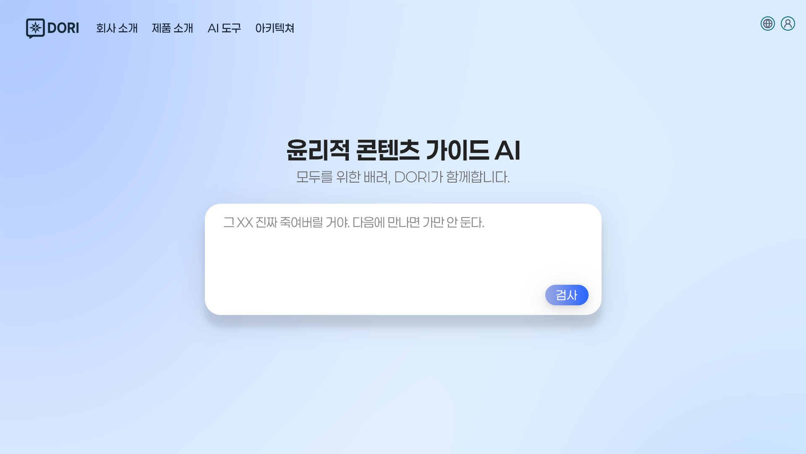
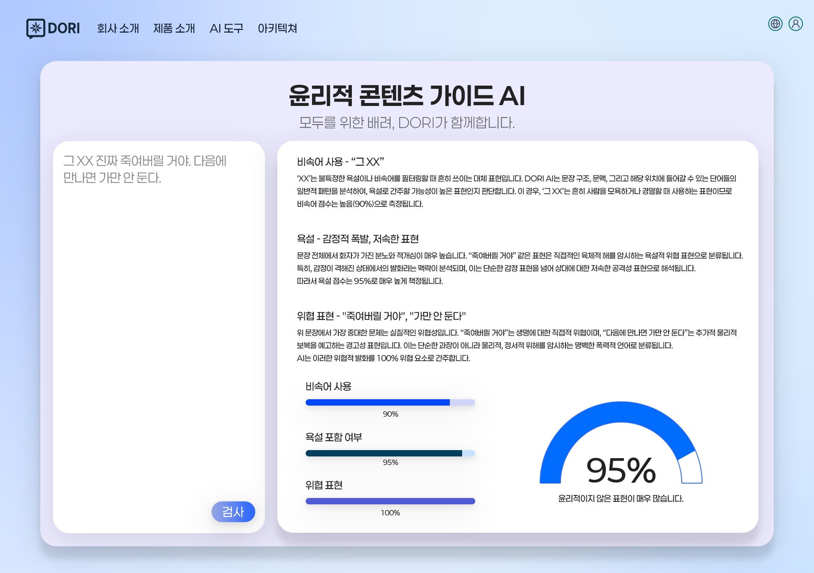
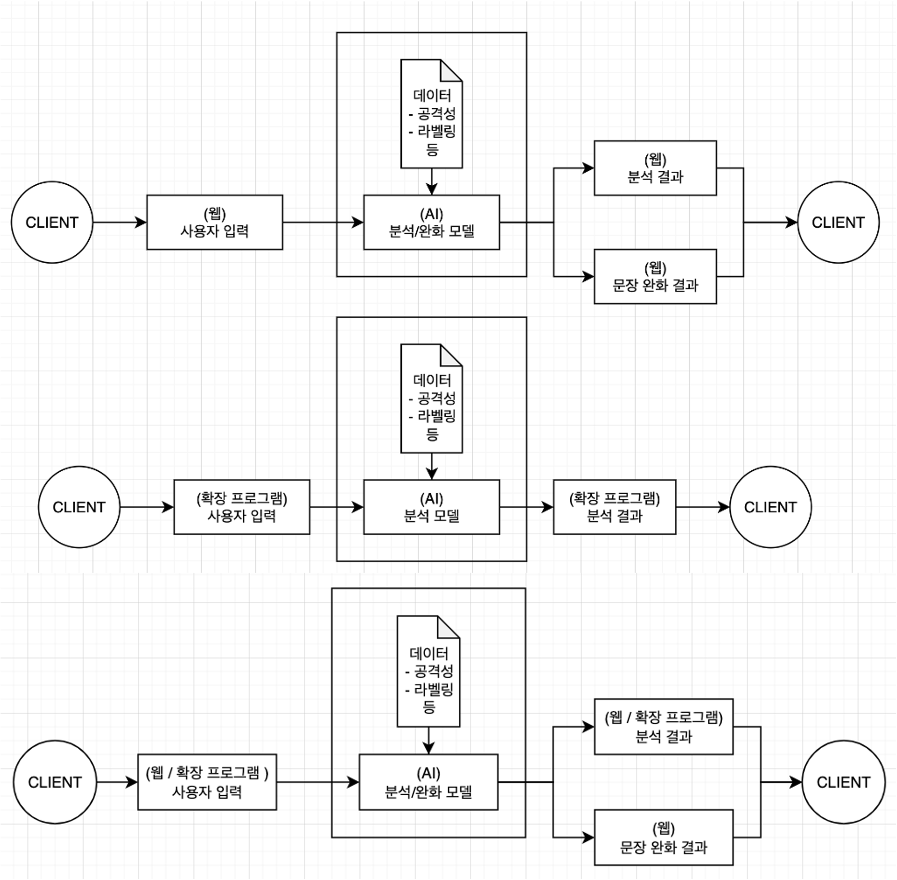

# AI DORI
<!--제품 관련된 상세 설명 작성 예정-->

AI DORI란?  
콘텐츠 윤리 경향성 분석 및 개선 가이드를 제공하는 AI 엔진(An AI System for Ethical Integrity and Fair Expression)  

</img>

## 유사기술과의 차별점
- 유사기술:  
  - OpenAI Moderation API - ChatGPT 콘텐츠 필터링
  - Google Perspective API - 유튜브, 언론사 댓글 모니터링
  - Naver SmartLens/Bubble - Bubble App 내 필터링
  - Kakao AI - 카카오 서비스 내 댓글 모니터링
  - Clarifai - 온라인 커뮤니티, SNS, 리뷰 플랫폼 (Photobucket, OpenTable)
  - AIF360 - 금융권에서 대출 승인 모델의 인종/성별 편향성 점검
  - RLHF - OpenAI InstructGPT / ChatGPT 답변 정확성 및 유해성 개선  

- 차별점:
  - AI 검열(기계적으로 필터링하는 형태)이 아닌 사람 중심 콘텐츠를 위한 윤리적 진단 도구라는 점에서 기존 필터링 도구와 차별성을 가짐
  - 윤리 기준을 시각화 및 등급화하여, 누구나 이해할 수 있는 설명 가능한 윤리 분석 결과를 제공
  - 기존 영어 중심 분석과 달리, 한국어 콘텐츠에 최적화된 경향성 탐지 및 평가 기능을 제공
  - 단순한 혐오 탐지를 넘어 사회적 고정관념, 배제 표현, 미묘한 윤리적 경향까지 정량화
  - AI 기반 윤리적 경향성 분석 제공 및 확장 플러그인 제공을 통한 사용자 접근성 편의 부문 특화
  - 텍스트부터 이미지, 음성, 영상까지 분석 가능한 멀티모달 부문 특화에 목표를 둠

## 결과물 예시
### 웹페이지 메인 화면
- 사용자가 검색창을 통해 텍스트 콘텐츠(뉴스, 댓글, LLM 답변 등)을 입력
</img>

### 웹페이지 분석 결과 화면
- AI가 윤리 경향성을 분석하여 시각화 자료와 함께 결과 제공 
</img>

## 아키텍처
> - 사용자 입력: 분석하고자 하는 텍스트 입력
> - 텍스트 분석: 제공된 텍스트에서 편향성, 혐오 표현 및 정서/감성 표현 등 분석
> - 분석 결과: 웹 화면을 통해 사용자에게 등급화 및 시각화된 분석 결과 표시

</img>  

